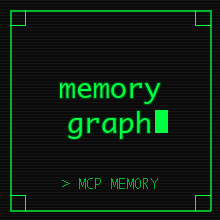

<p align="center">
  
</p>

<h1 align="center">MemoryGraph</h1>

<p align="center">
  <strong>Graph-based Memory CLI for AI Coding Agents</strong>
</p>

<p align="center">
  <a href="https://bun.sh/"></a>
  <a href="https://www.typescriptlang.org/"></a>
  
  
</p>

<p align="center">
  A graph-based memory system that gives AI coding agents persistent memory.<br>
  Store patterns, track relationships, retrieve knowledge across sessions.
</p>

---

## Using with Coding Agents

MemoryGraph is a CLI tool. Coding agents (Claude Code, Cursor, Windsurf, etc.) already execute shell commands, so they can use MemoryGraph directly. You just need to:

1. **Install the CLI globally** (one-time setup)
2. **Add agent instructions** to your project so the agent knows to use it

### Step 1: Install Globally

```bash
# Option A: bun link (recommended)
cd memory-graph/ts
bun link

# Option B: Compile a standalone binary
cd memory-graph/ts
bun build src/cli.ts --compile --outfile ~/.local/bin/memorygraph
chmod +x ~/.local/bin/memorygraph

# Verify it works from any directory
memorygraph stats
```

After installation, `memorygraph` is available as a shell command from any project. The default FalkorDBLite backend stores data in `~/.memorygraph/` so memories persist across projects and sessions.

### Step 2: Add Agent Instructions

Pick the instruction file your agent reads and paste the template below.

#### For Claude Code

Add to `~/.claude/CLAUDE.md` (global) or `.claude/CLAUDE.md` in your project:

```markdown
## Memory Protocol

MemoryGraph is installed. Use the `memorygraph` CLI for persistent memory across sessions.

### REQUIRED: Before Starting Work
Run `memorygraph recall --query "<task keywords>" --limit 10` to load relevant context.
Also run `memorygraph briefing` to get a session briefing with recent activity and open issues.

### REQUIRED: Automatic Storage Triggers
Store memories on ANY of:
- **Bug fix**: Store the problem (type: problem) and the solution (type: solution), then link with `memorygraph link <solution-id> <problem-id> SOLVES`
- **Architecture decision**: type: solution, tags: architecture
- **Pattern discovered**: type: code_pattern
- **Error encountered**: type: error
- **Session end**: type: conversation with session summary

### Commands
- Store: `memorygraph store --type <type> --title "<title>" --content "<content>" --tags "<tags>" --importance <0-1>`
- Recall: `memorygraph recall --query "<keywords>" --limit 10`
- Search: `memorygraph search --query "<text>" --tags <tags> --limit 10`
- Link: `memorygraph link <from-id> <to-id> <RELATIONSHIP_TYPE> --strength <0-1>`
- Related: `memorygraph related <id> --max-depth 2`
- Briefing: `memorygraph briefing`
- Stats: `memorygraph stats`

### Memory Types
solution | problem | code_pattern | fix | error | workflow | command | technology | project | file_context

### Tagging
- Lowercase, hyphenated: `api-design`, `error-handling`
- Always include the component: `auth`, `database`, `cli`
- 2-5 tags per memory

Do NOT wait to be asked. Memory storage is automatic when triggers fire.
```

#### For Cursor / Windsurf / Other Agents

Add to `.cursorrules`, `.windsurfrules`, or your agent's instruction file:

```markdown
## Memory System

Use the `memorygraph` CLI for persistent memory across sessions.

Before starting work: `memorygraph recall --query "<task>" --limit 10`
On decisions/fixes: `memorygraph store --type solution --title "<title>" --content "<content>" --tags "<tags>"`
Link memories: `memorygraph link <from-id> <to-id> SOLVES --strength 0.8`
Session start: `memorygraph briefing`
```

#### For Any Agent with Shell Access

Add this to your AGENTS.md, CLAUDE.md, or system prompt:

```markdown
## Memory

This project uses MemoryGraph for persistent memory. The `memorygraph` CLI is installed globally.

Before work: Run `memorygraph recall --query "<keywords>" --limit 10`
On fixes: Run `memorygraph store --type solution --title "<title>" --content "<what was done>" --tags "<component>,fix"`
On errors: Run `memorygraph store --type error --title "<error>" --content "<details>" --tags "<component>,error"`
Link: Run `memorygraph link <solution-id> <problem-id> SOLVES`
```

### How Agents Use It (Example Session)

```
Agent starts:
  $ memorygraph recall --query "authentication redis" --limit 10
  Found 3 relevant memories:
  1. Use JWT for auth (solution)
  2. Redis connection timeout (problem)
  3. Exponential backoff fix (solution)

  $ memorygraph briefing
  Session Briefing for my-app
  - 2 unresolved problems
  - Last activity: 3 days ago

Agent fixes a bug:
  $ memorygraph store --type problem --title "Auth token expiry too short" \
    --content "Tokens expiring after 1 hour causing user logouts" --tags "auth,bug"
  Stored memory: abc-123

  $ memorygraph store --type solution --title "Extend token expiry to 24h" \
    --content "Changed JWT expiry from 1h to 24h, added refresh token rotation" \
    --tags "auth,fix" --importance 0.8
  Stored memory: def-456

  $ memorygraph link def-456 abc-123 SOLVES --strength 0.9
  Created relationship: SOLVES

Agent ends session:
  $ memorygraph store --type conversation --title "Session: auth token fix" \
    --content "Fixed token expiry, added refresh rotation" --tags "auth,session-summary"
```

### Multi-Project Setup

By default, all projects share the same memory database at `~/.memorygraph/falkordblite.db`. To isolate memories per project, set a project-specific path:

```bash
# In your project's .env or shell profile
export MEMORY_FALKORDBLITE_PATH=~/.memorygraph/my-project.falkor

# Or use SQLite per project
export MEMORY_BACKEND=sqlite
export MEMORY_SQLITE_PATH=~/.memorygraph/my-project.db
```

Or tag memories with the project name so you can filter:

```bash
memorygraph search --query "authentication" --tags my-project --limit 10
```

### Troubleshooting Agent Integration

**Agent doesn't use memory commands:**
- Make sure the instruction file is in the right location (e.g., `~/.claude/CLAUDE.md` for Claude Code)
- Use strong language like "REQUIRED" and "MUST" in instructions
- Include the exact commands so the agent can copy-paste them

**`memorygraph` command not found:**
- Run `bun link` from the `ts/` directory
- Or compile to `~/.local/bin/memorygraph` and ensure `~/.local/bin` is on PATH
- Verify with `memorygraph health`

**Memories not persisting:**
- Check `memorygraph config` to see the database path
- Run `memorygraph health` to verify backend connectivity
- Ensure the `~/.memorygraph/` directory is writable

---

## Why MemoryGraph?

### Graph Relationships Make the Difference

Flat storage (CLAUDE.md, vector stores) keeps memories as isolated entries. Graph storage connects them:

```
[timeout_fix] --CAUSES--> [memory_leak] --SOLVED_BY--> [connection_pooling]
     |                                                        |
     +------------------SUPERSEDED_BY------------------------+
```

Query: "What happened with retry logic?" returns the full causal chain, not just individual memories.

### When to Use What

| Use CLAUDE.md / AGENTS.md For | Use MemoryGraph For |
|-------------------------------|---------------------|
| "Always use 2-space indentation" | "Last time we used 4-space, it broke the linter" |
| "Run tests before committing" | "The auth tests failed because of X, fixed by Y" |
| Static rules, prime directives | Dynamic learnings with relationships |

---

## CLI Commands

### Memory Operations

| Command | Purpose | Example |
|---------|---------|---------|
| `store` | Store a new memory | `store --type solution --title "Fix" --content "..." --tags redis,fix` |
| `get` | Get a memory by ID | `get <memory-id>` |
| `update` | Update an existing memory | `update <id> --title "New title"` |
| `delete` | Delete a memory | `delete <memory-id>` |
| `search` | Search with filters | `search --query "timeout" --tags redis --limit 10` |
| `recall` | Natural language recall | `recall --query "authentication security"` |
| `related` | Get related memories | `related <id> --types SOLVES,CAUSES --max-depth 2` |
| `link` | Create a relationship | `link <from-id> <to-id> SOLVES --strength 0.8` |

### Context Search

| Command | Purpose |
|---------|---------|
| `context-search` | Search relationships by type, strength, or context text |
| `contextual-search` | Search within a memory's related items |

### Intelligence

| Command | Purpose |
|---------|---------|
| `entities` | Extract entities (files, functions, classes, technologies) from a memory |
| `patterns` | Find similar problems and suggest patterns |
| `context` | Get intelligent context retrieval with entity and keyword matching |

### Analytics

| Command | Purpose |
|---------|---------|
| `stats` | Database statistics (memory count, types, relationships) |
| `activity` | Recent activity summary with unresolved problems |
| `visualize` | Graph visualization data (nodes and edges) |
| `similarity` | Analyze solution similarity for a given memory |
| `learning` | Recommend learning paths for a topic |
| `gaps` | Identify knowledge gaps (unsolved problems, missing connections) |

### Proactive

| Command | Purpose |
|---------|---------|
| `briefing` | Generate a session briefing with recent activity and open issues |
| `predict` | Predict what might be needed based on current context |
| `warn` | Warn about potential issues (deprecated approaches, known errors) |
| `outcome` | Record an outcome for a memory (success/failure tracking) |

### Integration

| Command | Purpose |
|---------|---------|
| `capture` | Capture task context from current environment |
| `analyze-project` | Analyze the current project codebase |
| `workflow` | Track or suggest workflow improvements |

### Temporal

| Command | Purpose |
|---------|---------|
| `as-of` | Query relationships as they existed at a specific time |
| `history` | Get full relationship history for a memory |
| `changes` | Show relationship changes since a timestamp |

### Data Management

| Command | Purpose |
|---------|---------|
| `export` | Export to JSON or Markdown |
| `import` | Import from JSON |
| `migrate` | Migrate between backends |
| `health` | Run a health check |
| `config` | Show current configuration |

---

## Backends

| Backend | Type | Config | Native Graph | Zero-Config | Best For |
|---------|------|--------|--------------|-------------|----------|
| **falkordblite** (default) | Embedded | File path | Cypher | Yes | Default, graph queries without server |
| **sqlite** | Embedded | File path | Simulated | Yes | Zero-dependency fallback |
| **falkordb** | Client-server | Host:port | Cypher | No | High-performance production |
| **memgraph** | Client-server | Bolt URI | Cypher | No | Real-time analytics |
| **cloud** | Cloud | API Key | Cypher | No | Multi-device sync, team sharing |

### Backend Configuration

```bash
# Use FalkorDBLite (default, zero-config)
bun run src/cli.ts stats

# Use SQLite
MEMORY_BACKEND=sqlite bun run src/cli.ts stats

# Use FalkorDB (client-server)
MEMORY_BACKEND=falkordb MEMORY_FALKORDB_HOST=localhost MEMORY_FALKORDB_PORT=6379 bun run src/cli.ts stats

# Use Memgraph
MEMORY_BACKEND=memgraph MEMORY_MEMGRAPH_URI=bolt://localhost:7687 bun run src/cli.ts stats

# Use Cloud
MEMORY_BACKEND=cloud MEMORYGRAPH_API_KEY=mg_your_key bun run src/cli.ts stats
```

### Environment Variables

| Variable | Description | Default |
|----------|-------------|---------|
| `MEMORY_BACKEND` | Backend type | `falkordblite` |
| `MEMORY_FALKORDBLITE_PATH` | FalkorDBLite database path | `~/.memorygraph/falkordblite.db` |
| `MEMORY_SQLITE_PATH` | SQLite database path | `~/.memorygraph/memory.db` |
| `MEMORY_FALKORDB_HOST` | FalkorDB server host | `localhost` |
| `MEMORY_FALKORDB_PORT` | FalkorDB server port | `6379` |
| `MEMORY_MEMGRAPH_URI` | Memgraph Bolt URI | `bolt://localhost:7687` |
| `MEMORYGRAPH_API_KEY` | Cloud API key | - |
| `MEMORYGRAPH_API_URL` | Cloud API URL | `https://graph-api.memorygraph.dev` |
| `MEMORY_TOOL_PROFILE` | Tool profile (core or extended) | `core` |
| `MEMORY_LOG_LEVEL` | Log level | `INFO` |

---

## Memory Types

| Type | Use Case |
|------|----------|
| `task` | Tasks and action items |
| `code_pattern` | Recurring code patterns or conventions |
| `problem` | Problems or challenges encountered |
| `solution` | Solutions, decisions, or approaches chosen |
| `project` | Project context, environment, setup info |
| `technology` | Technology choices and evaluations |
| `error` | Errors discovered |
| `fix` | Fixes applied to errors |
| `command` | Useful commands or CLI snippets |
| `file_context` | Context about specific files |
| `workflow` | Workflow or process descriptions |
| `general` | General purpose memories |
| `conversation` | Conversation summaries |

## Relationship Types

| Type | Meaning |
|------|---------|
| `RELATED_TO` | General connection |
| `BUILDS_ON` | New memory extends an older one |
| `CONTRADICTS` | New memory supersedes or invalidates an older one |
| `CONFIRMS` | New memory provides evidence for an older one |
| `SOLVES` | A solution solves a problem |
| `CAUSES` | One memory causes another |
| `REQUIRES` | One memory depends on another |
| `IMPROVES` | An improvement over an existing approach |
| `REPLACES` | Replaces an older approach |
| `DEPENDS_ON` | Workflow dependency |

---

## Memory Best Practices

### Session Workflow

```bash
# Start of session: recall recent context
bun run src/cli.ts recall --query "recent work" --limit 10

# During work: store decisions and patterns
bun run src/cli.ts store \
  --type solution \
  --title "Use JWT for auth" \
  --content "JWT tokens with 24h expiry, refresh token rotation" \
  --tags "auth,security,api" \
  --importance 0.8

# Link it to a prior decision
bun run src/cli.ts link <new-id> <prior-id> BUILDS_ON --strength 0.9

# End of session: store summary
bun run src/cli.ts store \
  --type conversation \
  --title "Session: auth refactor" \
  --content "Refactored auth middleware, added JWT, fixed token refresh bug" \
  --tags "auth,session-summary"

# Export backup
bun run src/cli.ts export --format json --output session-backup.json
```

### Add to CLAUDE.md or AGENTS.md

```markdown
## Memory Protocol

### REQUIRED: Before Starting Work
You MUST use `recall` before any task. Query by project, tech, or task type.

### REQUIRED: Automatic Storage Triggers
Store memories on ANY of:
- Git commit: what was fixed/added
- Bug fix: problem + solution
- Architecture decision: choice + rationale
- Pattern discovered: reusable approach

### Memory Fields
- Type: solution | problem | code_pattern | fix | error | workflow
- Title: Specific, searchable
- Content: Accomplishment, decisions, patterns
- Tags: project, tech, category (required)
- Importance: 0.8+ critical, 0.5-0.7 standard, 0.3-0.4 minor
- Relationships: Link related memories when they exist
```

---

## Architecture

### Project Structure
```
memory-graph/
├── ts/
│   ├── src/
│   │   ├── cli.ts              # CLI entry point (35+ commands)
│   │   ├── index.ts            # Library exports
│   │   ├── config.ts           # Configuration management
│   │   ├── database.ts         # Database interface
│   │   ├── models.ts           # Data models and schemas
│   │   ├── backends/           # Backend implementations
│   │   │   ├── falkordb-shared.ts  # Shared FalkorDB base class
│   │   │   ├── falkordblite.ts     # Embedded FalkorDBLite
│   │   │   ├── falkordb.ts         # Client-server FalkorDB
│   │   │   ├── bolt-shared.ts      # Shared Bolt protocol base
│   │   │   ├── memgraph.ts         # Memgraph (Bolt protocol)
│   │   │   ├── sqlite.ts           # SQLite fallback
│   │   │   ├── cloud.ts            # Cloud REST API
│   │   │   └── factory.ts          # Backend factory
│   │   ├── tools/              # CLI tool handlers
│   │   ├── intelligence/       # Entity extraction, pattern recognition, context retrieval
│   │   ├── analytics/          # Graph visualization, similarity, learning paths
│   │   ├── proactive/          # Session briefing, predictions, outcome learning
│   │   ├── integration/        # Context capture, project analysis, workflow tracking
│   │   ├── migration/          # Backend-to-backend migration
│   │   ├── sdk/                # Cloud API client SDK
│   │   └── utils/              # Export/import, validation, helpers
│   ├── tests/                  # 97 tests
│   └── package.json
├── docs/                       # Documentation
└── CLAUDE.md                   # Agent instructions
```

### Building

```bash
cd ts
bun install
bun test                    # Run tests
npx tsc --noEmit            # Type check
bun build src/cli.ts --compile --outfile memorygraph  # Compile binary
```

---

## Import / Migration

```bash
# Import from JSON export
bun run src/cli.ts import --input backup.json --skip-duplicates

# Migrate between backends
bun run src/cli.ts migrate --to sqlite --to-path ./local.db
bun run src/cli.ts migrate --to falkordblite --to-path ./graph.falkor --no-verify
bun run src/cli.ts migrate --to memgraph --to-uri bolt://localhost:7687
```

---

## SDK

The TypeScript SDK provides a client for the MemoryGraph Cloud API:

```typescript
import { MemoryGraphClient } from "memorygraph/sdk";

const client = new MemoryGraphClient({ apiKey: "mg_..." });

const memory = await client.createMemory({
  type: "solution",
  title: "Fixed timeout issue",
  content: "Used exponential backoff with retries",
  tags: ["redis", "timeout"],
});
```

---

## License

MIT License - see [LICENSE](LICENSE).

---

**Start simple. Upgrade when needed. Never lose context again.**
